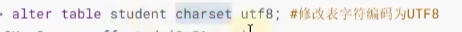
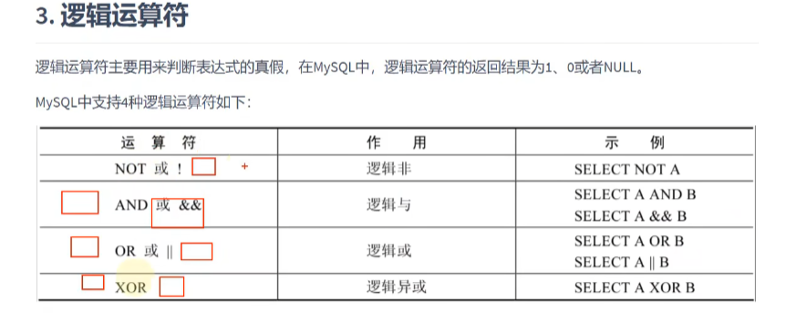
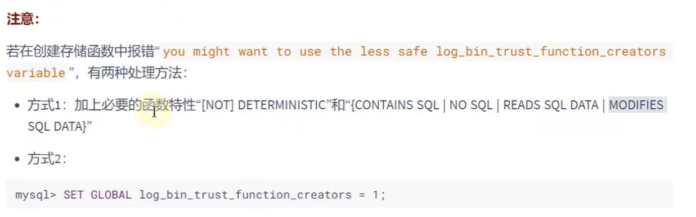
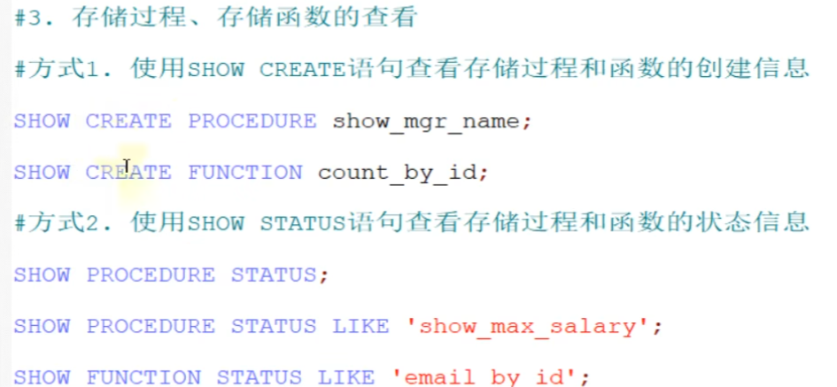
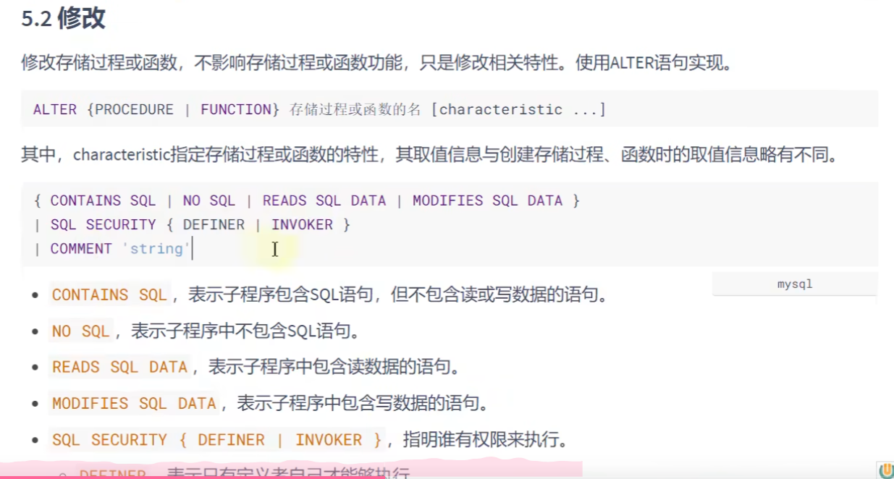

# 关系型数据库设计规则


ORM思想体现：

数据库中的一个表  <---> JAVA或Python中的一个类

表中一条数据    <------------>类中一个对象（或实体）

表中一个列  <--------------->类当中的一个字段（属性、field）

# 命令：

## mysql控制台登录：

-P(大写的)是端口号,不同数据库管理程序可以使用不同端口，不同版本也是，通常不会用到    -h 主机名(或者数据库所在主机的ip地址)  -p(小写)密码  -u用户名


## 创建数据库：

create database 数据库名

## 使用数据库

user database 数据库名

## 创建表

create table 表名 (字段名 字段类型,字段名 类型)

## 往表中插入数据

insert into 表名 values(字段1，字段2) 字段1字段2必须和创建表时候的顺序一样

## 修改字符编码：

show variables like 'character_%'; 查看各个功能的编码方式


修改数据库目录下的配置文件my.ini

在mysql标签下加入

default-character-set=utf8

mysqld标签下加入

character-set-server=utf8

collation-server=utf8_general_ci

改完之后要重启服务


8.0版本之后默认是utf8 

## mysql重置密码：


## 单独修改数据表编码：数据库也类似,只不过table改成database




# SQL语句

是structural query language（结构化查询语言）的缩写

## 分类：

### ddl(data definition language、数据定义语言)

rename重命名、truncate清空表、表、数据库等删除用drop、删除记录用delete


### dml(Data Manipulation Language、数据操作（定义）语言)   增删改查、select最重要


### dcl(Data Control Language、数据控制语言)


## sql语言的规则与规范

\g:其实和分号一样，表示一行命令的结束


字符串、日期时间类型的变量需要使用一对单引号''表示

列的别名尽量使用双引号不建议省略as


### sql大小写规范：

windows不区分大小写、

但是Linux区分大小写，必须大小写也一模一样,不过Linux中关键字、函数名、列明、列的别名是忽略大小写的


### 注释


## 导入现有的数据到数据库

方式1：source 文件的全路径名

方式2：基于具体的图形化界面的工具可以导入数据


## 最基本select语句：

SELECT 字段1，字段2，。。。FROM 表明

\*  :  表中所有字段


## 别名

select字段 as 别名 from 表名即可,如   as可省略，但不建议 as 全称：alias(别名)不是好像

SELECT employee_id as id,last_name as name,salary
FROM employees;

查询出来后结果集字段名就会显示成别名，

列的别名可以使用一对双引号引起来,双引号也可以省，但部分情况不能省,如别名中包含空格

## 去除重复行

在字段前加个DISTINCT

SELECT DISTINCT department_id FROM employees


## 空值参与运算：结果也一定为空(null),注意空值和0不是一个东西

## 着重号``在表名或字段名等和sql关键字重复时，需要用着重号括起来表示这不是关键字


## 查询常数：select后有常数的话会在每一行都加上常数


## 显示表结构：describe 表名 DESC也是一样的


## WHERE过滤数据

select \* from xx where xxx = xxx

where必须紧挨着from后面


## 运算符

1.算术运算符：+-* / div % mod

select 100 + '1' 在java中，结果是1001，因为当作字符串拼接

而在sql中+没有拼接作用只表示加法运算，会隐式转换为数值进行计算

select 100 + 'a' 此处a会当作0处理

select 100  +  null    任何与null作的运算都为null


sql中除法默认返回浮点型

取模时符号只与被模数有关，与模数无关


## 比较运算符


一边数字一边字符会将字符隐式转换成数字（非数字字符为0，数字字符则相应数值）

如果是字符与字符比较则会根据ascii码值比较大小而不会进行隐式转换


判断时如果判断式子为 xxx=null则不会返回任何值。因为比较是要为1才返回，而null与任何值比较都是null不为1所以不会返回


### 安全等于<=>

可以让null作比较


### 常用运算符


<>不等于号


between 下限 and 上限

上下限写反了就找不到了

not between 就取两边

in/not in筛选离散的数值时候用这个,后面跟的是一个集合(括号括起来，逗号分隔)，就是属于或者不属于这个集合的才被输出出来

### 模糊匹配：

%:表示不确定个数的字符包括0个

_ 一个下划线代表一个不确定字符

名字第二个字符是a的员工姓名：


转义字符：\如果需要查有下划线相关的就\\_


## 正则表达式


查出数据再用，所以总在select xxxx from xxxx之后


## 逻辑运算符




异或：追求的”异“，只有两个一个满足一个不满足才为真

and优先级高于or


# 排序与分页


## 排序：

使用order by 对查询到的数据进行排序操作

在排序的字段后加上desc变成降序，默认为升序asc

可以使用别名进行排序


列的别名只能在ORDER BY 使用，不能在WHERE使用。


如果where使用别名会报错

且ORDER BY 必须在WHERE 后面

ORDER BY 的字段也可以不是查询的字段


### SQL语句执行顺序

1.from 和 where 语句

2.select 语句

3.ORDER BY语句

所以from where 处无法使用select中创建的别名，因为别名还没声明。而ORDER BY 可以


### 二级排序：

在前面排序基础上还相等则按照二级排序来排

后面应该还可以整三级四级,原理是一样的，都是前面相同再使用后面的排序


## 分页


需要访问那一页数据再查，否则不查，节约资源


mysql使用limit实现分页显示


LIMIT后第一个参数是偏移量，即往后多少条数据开始查询。20代表从21条开始查，跳过前面20条

第二个参数是每页多少条数据

公式： LIMIT (oageNo-1)\*pageSize,pageSize;

如果LIMIT从0开始0可以省略只写每页页数

即 LIMIT 0,20 等价于 LIMIT 20


#limit的参数没有小括号


### WHERE  ORDER BY   LIMIT $声明$顺序：

LIMIT 在 ORDER BY 后面，ORDER BY 在WHERE 后面


### 8.0新特性

LIMIT XXX OFFSET XXX

输入数字顺序和上面的反一下，这里偏移在后面，页数在前面


# 多表查询

防止为了查询某个信息需要来回发送多次请求和多次io才能找到某个数据，提高查找效率

因为多表查询如果分开来的话是要执行很多次才能找到。如果放到一条sql就能大幅提高效率


## 笛卡尔积

两张表，其中一张表每一条数据都与另一张表所有数据进行匹配并返回，

最终得到第一张表数据条数*第二张表数据条数的数目。这就是笛卡尔积，就是把两张表所有可能的组合都输出了


### 出现笛卡尔积错误的原因：

缺少了多表的连接条件


### 多表查询正确方式：需要有连接条件

查询链接条件的字段时会报歧义的错误，这时需要在select中告诉他需要查那张表中的字段


建议：从sql优化的角度，建议多表查询时，每个字段前都指明其所在的表

这样写时sql语句过长，可读性差，可以起别名缩短语句

表名取别名在from中


#### 如果起了别名就不能用原名，只能用别名


## 多表查询分类：等值连接，非等值连接、自链接，非自连接、内连接，外连接

### 非等值连接例子：

查询员工工资等级：因为等级是一个工资范围，而等级和工资又分别在两张表，所以需要非等值连接



### 自连接例子

查询员工id，员工姓名及其管理者的id和姓名



## 内连接、外连接



就是两个表没有关系的行也列出来，因为有些关联的地方是null时就会少查出一点数据

外连接分类：左外连接、右外连接、满外连接


### SQL92的外连接：

使用+



哪边短哪边给个+号


### SQL99语法使用 JOIN....ON 实现多表查询


#### 内连接：

表名 join 表名 on 合并条件

还有的话再 join 再 on


#### 外连接：

左外连接：left join 、右外：right join


#### 满外连接：

FULL OUTER JOIN 、MySQL不支持

#### union、union all

union：需要去重、效率低

union all：效率高，但交集会重复

所以当没有交集用union all效率最高

有交集用union保证数据不重复


#union前后连接的表名顺序最好是相同的，否则查出来两次查询显示顺序不同






下面两个图可以用上面的union all组合而来

所以重要的是实现上面五个图

### sql99新特性1：自然连接

会自动查询两张连接表中所有相同字段然后进行等值连接

虽然简洁但是不灵活，比较死板

### sql99新特性2：USING



简单来说就是指定用哪个字段来连接

# 函数





## 两种SQL函数



### 单行函数：

进去一个参数出来一个结果



### 多行函数:

进去多个参数出来一个结果

## 数值函数



其中ROUND(x,y)中y为负数时往整数方向保留，且后面小数也全部清空，

如 ROUND(124.1234，-1)=120   看个位数四舍五入

   ROUND(151.1234,-2)=200    看十位数四舍五入


TRUNCATE:截断，没有四舍五入，截断位数及之后数值全归0


单行函数可以嵌套


圆内旋转一定角度后弧的长度与半径相同，这个角度叫做一个弧度


## 字符串函数


注意：

ascii(s)：只返回第一个字符对应的ascii码

concat可以将结果合并成一个字段（一列）在输出

concat_ws:比concat多一个连接符.


SUBSTR 的index从1开始,没有0

## 日期和时间类型函数


从后面给的时间提取出需要的时间类型


GET_FORMATE传入的参数：


就是获得这种格式，可以拿来解析时间:

如


### 日记函数心得

格式化为大写Y小写m小写d,且是对日期格式的变量进行操作，是由日期转换成字符串，自己输入的字符串要用STR_TO_DATE
DATE_FORMAT(date,format)是将日期变量转换成字符串的函数，别搞混了方向


## 流程控制函数


CASE WHEN 中间没有字段相当于if elif else

CASE WHEN 中间有字段相当于 SWITCH.。。。 CASE 。。。。

使用例子：case前一定有逗号，因为是当作是新的一个字段。最后一定有个END再写别名,其他情况在最后放个else

```sql
SELECT last_name,department_id,salary,CASE department_id WHEN 10 THEN salary*1.1
                                                                        WHEN 20 THEN salary*1.2
                                                                        WHEN 30 THEN salary*1.3 
                                                                        ELSE salary*1.4 END 'details'
FROM employees;

SELECT last_name,department_id,salary,CASE department_id WHEN 10 THEN salary*1.1
                                                                        WHEN 20 THEN salary*1.2
                                                                        WHEN 30 THEN salary*1.3 
                                                                        END 'details'
FROM employees
WHERE department_id IN(10,20,30);


```

查询语句自带循环


## 加密解密函数


md5加密后不可逆，但是输入相同字符串生成的是相同的密文，所以直接比较密文就知道输入是否一致。


## mysql信息函数


# 聚合函数

输入一组数据集合，输出单个值,属于多行函数


## 常用聚合函数：

mysql中聚合函数不能嵌套使用


### avg/sum

只适用于数值类型的字段


### max/min

适用于数值类型、字符串类型、日期时间类型的字段


### count

计算指定字段在查询结构中出现的个数

如果计算表中有多少条记录可以使用的方式：

1.count(\*)

2.count(1)

3.count(具体字段)：不一定对！要是出现null就会忽略,要是字段全非空时候就是对的

### 方差、标准差、中位数


### 1.group by

按照字段分组，属于这个字段的就划分成一组

如按照部门分组，属于同一部门的都会被划分到一组内，聚合函数就可以针对每一组进行计算

如果用到了group by，那么select中声明的非组函数字段都必须出现在group by中，否则查出来都是没意义的，orcacle甚至会报错

而group by中出现的可以不出现在select中

所以必须仔细思考选择select和group by的词条。

group by 声明在from后面，where后面、order by前面、limit前面

#### 新特性：


就是计算完后在最后多插一行计算整体的 


### 2.having

用来过滤数据、和group by 有关系

一旦过滤条件中使用了聚合函数，则必须使用having来代替where否则报错 \ 要是where内部过滤条件有聚合函数则无法使用，只能用having 

如where max(xxx)>xxx就是错误的

如果出现having，having必须声明在group by后面

having作用相当于比较每组根据聚合函数算出来的东西

所以没有group by使用having意义不大


但是where执行效率比havin高。所以能用where就用where


### having和where对比：

having使用范围更广

在过滤条件中没有聚合函数时，where执行效率比having更高  

所以能用where就用where


### sql底层执行原理


## sql执行过程


每个大模块内部是按顺序执行的

from...->链接->where->分组->having->select->distinct->order by->limit

where效率高原因：可以减少后面group by和having再过滤的工作量

如10w条经过where就剩10条那后面就很快就能执行完

如果没有where后面group by要对10w条数据进行分组，组内还要根据having进行排序、计算什么的但是最后只留下两条数据

这样就浪费了很多计算

因为聚合函数是分组后才能用而where在分组前执行所以where不能使用聚合函数


## 错题：数有没有员工时对行进行count，而不是员工id

7.查询所有部门的名字，location_id，员工数量和平均工资，并按平均工资降序

#因为要所有部门，所以要使用外连接,而此时count不应该是行数，而是有多少个employee_id，因为没有员工他也会有一行SELECT d.department_name,d.location_id,count(employee_id),AVG(e.salary) avg_salFROM departments d LEFT JOIN employees e ON d.department_id=e.department_idGROUP BY e.department_id,d.department_name,d.location_idORDER BY avg_sal DESC


# 子查询


## 子查询分类：

### 单行子查询、多行子查询


子查询编写技巧：

1.从里往外写 2.从外往里写

### 相关子查询、不相关子查询

相关子查询：子查询的条件随着主查询改变而改变,也就是子查询和主查询有相关性


### 子查询中空值问题：

子查询空值不会报错，但是查不出东西


## 多行子查询


ANY:返回结果中任意一个,只要有一个满足就行

ALL：返回结果中全部，要全部满足才行


可以把查出来的信息当成一张新表，外面再套一层select  from查询这张新表的数据。但是要给新表取一个别名


多行子查询空值问题


如 1 NOT IN(2,NULL)-->1!=2&&1!=null,而1！=null返回的永远是null

所以not in中如果有null就一定查不到东西。

所以在使用多行子查询时，一定要把查询结果中带有null的去掉


## 相关子查询

练习：找出部门中比部门平均工资高的员工信息


在select中，除了group by和limit之外，其他位置都可以声明子查询


找出在员工id在jobhistory中出现两次以上的员工id，姓名，等信息

```sql
#法1：from内子查询
SELECT e.employee_id,e.last_name,e.job_id
FROM employees e ,
(
SELECT employee_id,count(employee_id) changeTIME
FROM job_history jh 
GROUP BY employee_id
) job_times
WHERE job_times.employee_id = e.employee_id AND changeTIME>=2

#法二：相关子查询
SELECT employee_id,last_name,job_id
FROM employees e
WHERE 2<=(
                        SELECT count(*)
                        FROM job_history jh
                        WHERE e.employee_id=jh.employee_id
                    )
```


### exist、not exist

和子查询中的表进行连接，如果连接上了exist就成立，如果没连上not exist就成立


错题：

  #8.查询平均工资最低的部门信息(嵌套子查询方式，拼了大半小时看几眼答案才拼出来)

```sql
SELECT d.* ,AVG(salary)
FROM departments d,employees e
WHERE d.department_id=e.department_id
GROUP BY e.department_id
HAVING AVG(salary)<=ALL(
                        select AVG(salary)
                        FROM employees
                        GROUP BY department_id
                        );
#法二：嵌套子查询，根据查部门平均工资表找到最低的,因为where内无法用聚合函数所以只能找到id，这里没必要用聚合函数
SELECT *
FROM departments
where department_id=(
                      SELECT department_id
                      FROM employees
                      GROUP BY department_id
                      HAVING avg(salary)=(
                                             SELECT MIN(avg_sal)
                                             FROM (
                                                     SELECT AVG(salary) avg_sal
                                                     FROM employees
                                                     GROUP BY department_id
                                                   ) t_avg_sal
                                           )
                      );
```

#9.查询平均工资最低的部门信息和该部门的平均工资（相关子查询）上面一题基础上在后面再加一条平均工资的字段

主要是没想到原来是输出平均工资需要用子查询

```sql

SELECT d.*,(SELECT AVG(salary) FROM employees WHERE d.department_id=department_id) avg_sal
FROM departments d
WHERE department_id = (
                                                SELECT department_id
                                                FROM employees
                                                GROUP BY department_id
                                                HAVING AVG(salary)<= ALL(
                                                                                                    SELECT AVG(salary)
                                                                                                    FROM employees
                                                                                                    GROUP BY department_id
                                                                                                )
                                            );
```


```sql
#15. 查询部门的部门号，其中不包括job_id是"ST_CLERK"的部门号
#这种方式不会返回没有员工的部门,不符合题意
SELECT DISTINCT d.department_id,e.job_id
FROM employees e RIGHT JOIN departments d
ON e.department_id=d.department_id
WHERE e.job_id <>"ST_CLERK"

SELECT department_id
FROM departments d
WHERE NOT EXISTS(
SELECT *
FROM employees e
WHERE d.department_id = e.department_id 
AND e.job_id = "ST_CLERK"
);


```


```sql
#18.查询各部门中工资比本部门平均工资高的员工的员工号, 姓名和工资（相关子查询）

SELECT employee_id,last_name,salary
FROM employees e1
WHERE salary>(
SELECT AVG(salary)
FROM employees e2
#这里相当于已经分好组了，每次avg的内容都是一个部门里面的
WHERE e1.department_id=e2.department_id
                        );

```


```sql
#19.查询每个部门下的部门人数大于 5 的部门名称（相关子查询）
SELECT department_name
FROM departments
WHERE department_id IN(
            SELECT department_id
            FROM employees
            GROUP BY department_id
            HAVING count(employee_id)>5
            );

SELECT d.department_name
FROM departments d
WHERE 5<(
            SELECT count(employee_id)
            FROM employees e
            WHERE e.department_id=d.department_id
            );
```


# DDL语句

## 多表同时删除DELETE m,d FROM xxx JOIN xxx ON xxx

如

```sql
DELETE e,u
FROM my_employees e 
JOIN users uON e.userid=u.userid
WHERE e.userid = 'Bbiri'
```


添加数据时要是某个字段没有值应该填入null，否则无法添加


# 数据类型


在指定字段属性后加个unsigned表示无符号数

## 表和具体字段也可以指定字符集

给表设置字符集在写完字段之后

给字段设置在字段属性后

CREATE TABLE tb(

name varchar(20) CHARACTER SET$ 'utf8'$

)CHARACTER SET $'utf8'$


## 整型


插入数据时超出数据范围会报错


### ZeroFill: (mysql8.0中已经过时)

在指定数据显示宽度后如果跟上了ZeroFill，如果插入数据宽度不够显示宽度，就会在高位补0来使数据宽度达到定义时的宽度


其中f3是类型为int(5) ZeroFill

### 适用场景


### 选择：优先保证数据不会超出范围，再考虑节省空间


## 浮点型


也就是说浮点数没必要定义成无符号


小数位超过设置的长度，会发生四舍五入

整数位超过设置长度，会报错


MYSQL8.0中DECIMAL类型比float和double精度更高,因为是字符串存储的


浮点数存储数据更多，但是会丢失一点精度，decimal占用空间稍大，但是绝对精准


开发中一直都是愿意使用空间换取可靠性的，可靠性一旦出问题付出的代价比购买存储设备大多了


## 日期类型


2位格式可以忽略、已经没有太大意义,还很复杂

year默认是四位，不用指定

year最大2155，最小1901


直接一堆数字写进去会进行隐式转换


前面time、date各3字节

DATE_TIME:8字节

TIMESTAMP：4字节

now()默认是datetime格式，但是根据插入的数据类型会自动进行隐式转换


timestamp虽然占的空间少，但是可以设置的范围也有限

@符分割时间字符串中年月日时分秒可读性更强


### timestamp和datetime区别：

timestamp会根据用户所在时区进行转换，datetime输入是什么输出就是什么

如输入时时区是东八区，后面系统改成东九区，timestamp类型就会自动加一个小时

timestamp底层是毫秒数、按照时间排序时timestamp速度会更快


开发中使用datetime最多，因为范围最广、存储最完整


## 文本字符类型


varchar需要额外一字节空间来记录当前存储了多少字节数据，从而达到可变长度的目的

char类型指定多少就一只占用多少空间，如果在长度确定的情况下char更好

char在添加时若没有达到长度则会在右边补空格，而在查询时在自动去掉

但是如果是手动在右边添加空格查询时也是会被去掉的


### varchar优点

指定多少就能存多少字符，所以占用的空间不一定是指定大小的字节数

最大是65535字节

如果数据库默认编码是utf8，这个数值会自动转换成中文字符大小，即65535/3=21845

虽然varchar需要一个字节计算存储了多少个字符。但是大多数情况下都能比char更节省空间，因为只给数据需要的大小


### char优点

由于是固定长度的，所以可以实现随机存取，检索效率高，所以适用在数据小，检索速度要求高的场景


## TEXT类型：适合存储大量文本、文章、小说等


## 枚举类型：


只要这个字段设置成枚举类，就只能从创建时设置的数据选一个，填其他东西都是报错

## Set类型


SET:可以从中选0个或多个，比枚举灵活一点


存储策略和char、varchar类似

binary固定，空的补，varbinary可变长度，要多少给多少


类似test，但是存储二进制数据，如二进制存储图片、音视频等

但实际开发中图片、音视频都是直接存储在磁盘，不需要存在数据库


# 约束

为什么需要约束？：为了保证数据的完整性

什么叫约束？


## 约束的分类


1.约束的字段个数区分

单列约束、多列约束


2.约束的作用范围

列级约束、表级约束

列级约束：将此约束声明在对应字段后

表级约束：在表中所有字段都声明完，在在最后声明的约束


3.约束的作用


如何添加约束？

创建表CREATE TABLE时添加

修改表ALTER TABLE时可增加、删除约束


## 非空约束：NOT NULL,只能针对某个列设置


## 唯一性约束


表级约束语法：创建表声明完字段后，最后一个字段接逗号后接着写约束，

Constraint 约束名 什么约束 作用的字段

可以向声明为unique的字段添加null值

null值不算unique，可以有多个null。都是空不代表相同


添加约束写法和表级约束是一样的


### 复合唯一性约束：

同时给多个字段添加唯一性约束，此时相当于多个字段组成一个整体，只要有一个字段不相同就可以添加


实际应用：学号和课程作符合唯一约束，即同一个学生不能重复选一门课


### 删除唯一性约束

通过删除唯一性约束来删除唯一性索引

复合唯一性约束若没指定名字 则默认约束名为声明复合约束的第一个字段


## 主键约束

主键约束列不允许重复，也不允许出现空值,相当于非空约束+唯一性约束


主键表级约束：

CONSTRAINT 约束名 PRIMARY KEY (约束字段)


### 主键复合约束：创建方式和上面复合唯一性约束一样

也是和上面差不多，复合的字段只要有其中一个不相同且都不是null就可以(主键的复合约束所有复合的字段都不能是null)


### 创建表后添加主键约束

ALTER TABLE 表名

ADD PRIMARY KEY (字段名)


### 删除主键约束，不需要知道主键名（实际开发不会使用,因为生成表后，里面所有数据都是根据主键生成的b+树，如果删了那就白费了,无法根据主键索引查找数据）

ALTER TABLE 表名 DROP PRIMARY KEY


## 自增列：auto_increment

语法：

CREATE TABLE 表名（

id int PRIMARY KEY AUTO_INCREMENT

）


主要是给主键使用

向自增主键字段上添加0或者null时会自动增长到下一个数，而不是把0或null添加进去

写其他值都会直接填进去。

要是出现了断层，则会从最大的数值往后增长，而不会填补中间空缺


### 在创建表之后增加自增

ALTER TABLE

MODIFY id int AYTO_INCREMENT


### 删除自增,在修改时去掉AUTO_INCREMENT就可以了

ALTER TABLE

MODIFY id int 


### 新特性：自增变量的持久化

5.7中自增的下一个数存储在内存中，重启后就要重新读表才知道下一个自增是谁

8.0中自增下一个数被永久保存在磁盘中，当然运行时也在内存中。重启服务器后会从磁盘中读取下一个自增是哪个数，所以即使删了末尾两个,下一个自增也不会再写在上两个删除的地方


## 外键约束


子表要和主表产生外键约束，约束的必须是主表的主键字段。

最好自己指定外键名，因为默认不是字段名，到时要查也麻烦

外键与主键名可以不一样，类型必须一样

创建外键约束时，默认给外键所在列创建普通索引。

### 表级外键约束语法：

CONSTRAINT 外键名 FOREIGN KEY (从表字段名) REFERENCE （主表主键名）

外键关联的主表字段一定要是主键或者唯一约束的字段


### 约束等级


其实就是主表从表数据是否同步更新、如何更新的问题

CASCADE:同步主表的操作

SET NULL:主表操作后将外键对应字段设置为null

RESTRICT:从表有对应数据时不让主表进行操作

可以单独设置更新时怎样，删除时怎样如

CONSTRAINT 外键名 FOREIGN KEY (从表字段名) REFERENCE （主表主键名）ON UPDATE CASCADE ON DELETE SET NULL

可以不用CONSTRAINT,这个关键字是用来设置外键别名的


### 删除外键约束

ALTER TABLE DROP FOREIGN KEY 外键名


### 删除外键约束对应的普通索引

1.SHOW INDEX FROM 表名

2.ALTER TABLE 表名 DROP INDEX 约束名

这里删除索引也是根据外键约束名删

### 使用建议


总结：应该在java代码逻辑中体现这种约束而不是依赖mysql的外键。所以不建议使用


## CHECK 约束，创建表时加在字段后

5.7不支持check

添加数据时判断一下是否符合，符合则添加，不符合则不添加


## DEFAULT约束，创建表时加在字段后

在输入null或者没有数据时，默认添加的值。


删除约束：ALTER TABLE时不指定DEFAULT就可以

# 视图


## 创建视图：

和复制表一样，只不过table改成VIEW 。CREATE VIEW 视图名 as select（查询想要放到视图的字段和数据）... 

然后对视图操作，更改数据后原表的数据也会跟着更改

视图其实就是把原表东西展示出来，修改视图就是修改原表


小型项目不推荐使用视图

可以基于视图继续创建视图。无限套娃

## 查看视图：

查看数据库中所有表和视图

SHOW TABLES


### 查看视图结构

DESC/DESCRIBE 视图名


### 查看视图属性信息

SHOW TABLE STATUS LIKE '视图名'


### 查看视图定义信息

SHOW CREATE VIEW 视图名


## 更新视图数据，其实就是对源表数据进行修改

UPDATE 视图名 SET xxx WHERE xxx ,语法和修改表一样


视图主要是用来查询的，别用来干其他的就行了

## 修改视图

1.

在创建视图时加个OR REPLACE就可以修改视图


2.

ALTER VIEW


## 删除视图：

DROP VIEW IF EXISTS


## 视图作用


在对表没有访问权限情况下给用户需要的字段的视图的权限，可以访问数据也可以对不想让用户知道的字段起到保密作用


## 缺点：


# 存储过程与存储函数


IN:传入的参数

OUT:返回


DELIMITER : 指定以哪个符号作为结束符号

delimiter \$:以美元符号作为结束符

存储过程调用：CALL 存储过程名

存储过程名

中间begin end 就像java函数名左花括号右花括号

有需要返回的就 SELECT INTO 返回那个参数就可以


传入参数时在参数前加个@代表是用户定义的参数

OUT时这个参数相当于一个表，SELECT他就可以获得存储过程返回的表或其他东西


INOUT:传入传出都是使用那个参数，不用定义多个参数


## 函数


函数参数部分只有输入参数

输出通过return返回

CHARACTERISTICS的定义与上面存储过程类似



SET GLOBAL log_bin_trust_function_creators = 1;

例：


## 存储函数和存储过程对比


## 存储过程和函数的查看、修改、删除


## 存储过程、存储函数的修改、删除

### 查看




### 修改



#### 存储过程无法修改存储/函数体,只能改一些特性


#### 如果要改里面执行过程需要先删除再重新创建


## 删除


## 开发建议


